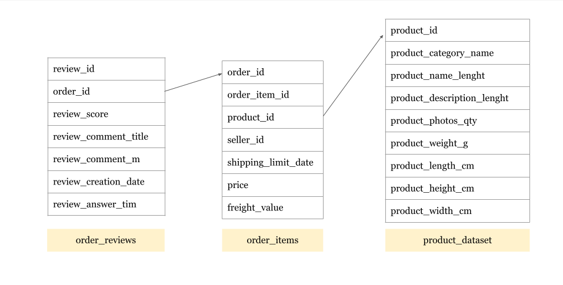

<h1 align="center">Merchant Analysis</h1>

*Further information about dataset is available to read [here](https://www.kaggle.com/olistbr/brazilian-ecommerce?select=olist_orders_dataset.csv)*.

After OLIST's product becomes a product-market fit, the next goal of the growth team is to optimize the experience and expansion by increasing the number of orders. As the Bill said, 

    🔷 “The key to successful e-commerce is in increasing shopping cart size; that’s really where the money is made. 
    I like to think of customer acquisition cost as a fixed cost, so any **increase in order size is expanding your margin”
    (Bill D’Alessandro of Skyway Ventures, a private investment firm focused on e-commerce)

The growth team realized that discounts on certain types of products could push people to buy more products. Understanding in consumer's most favorite product could help the succession of the campaign. As a two-sided marketplace, this research will understand that by observing the seller's sales performance.

## 📁 Key Objective

Provide insightful dashboard to Merchants Team ➡️ to get deeper insight on merchant's performance.

1. Merchants growth → average yearly order 
2. The amount of money spent on a purchase → average shopping cart size
3. The percentage of orders that have received negative feedback → Order Defect Rate (ODR)
4. Top outlets based on product order quantity

## 📁 Entity Relationship Diagram (ERD) of Dataset

  

## 📁 Conclusion

- Average Daily ➡️ Order The quantity of the purchased product and the amount of money earned does not have a positive correlation. It makes the campaign should focus on either making people buy more products or spend more money.
- Average shopping cart size ➡️ There are quite a lot of differences in purchase between the first two sellers and the third. It turns out that the first and the second store sell similar types of goods. Further research needs to determine the number of consumers on each product to make an effective campaign increase the order size to expand the margin.
- Order Defect Rate (ODR) ➡️ Based on the ODR value, most of the top 5 sellers have good ratings from consumers.

## 📁 Product Recommendation

Here's the product suggestion for upcoming campaign:

  - Cama_mesa_banho (bed bath table)
  - Moveis_decoracao (furniture_decor)
  - informatica_acessorios (computers_accessories)
  - Beleza_saude (health_beauty)
  - ferramentas_jardim (garden_tools)
  - relogios_presentes (watches_gifts)
